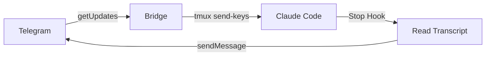

# Polling Simplification Implementation Plan

> **For agentic workers:** REQUIRED: Use superpowers:subagent-driven-development (if subagents available) or superpowers:executing-plans to implement this plan. Steps use checkbox (`- [ ]`) syntax for tracking.

**Goal:** Replace the HTTP server + cloudflared + webhook setup in `bridge.py` with a self-contained Telegram long-polling loop, reducing setup from 6 steps to 4.

**Architecture:** Remove `Handler`/`HTTPServer`, add `telegram_poll()` (dedicated poller with 35s client timeout), `poll_updates()` (main loop with offset tracking), and `telegram_send()`. Extract `handle_callback`/`handle_message` as module-level functions. `main()` calls `deleteWebhook` before entering the poll loop.

**Tech Stack:** Python stdlib only (`urllib.request`, `threading`, `subprocess`, `http.server` removed). No new dependencies.

**Spec:** `docs/superpowers/specs/2026-03-13-polling-simplification-design.md`

---

## Chunk 1: Tests + Implementation

### Task 1: Create test file with tests for new functions

**Files:**
- Create: `tests/test_bridge.py`

- [ ] **Step 1.1: Create tests/test_bridge.py**

> **Note:** All `pytest` commands in this plan must be run from the repo root (`/home/alstar/alstar_ws/claudecode-telegram`). The test file uses `sys.path.insert(0, ".")` to locate `bridge.py` at the repo root.

```python
"""Tests for bridge.py polling refactor."""
import json
import os
import sys
import time
import unittest
from io import BytesIO
from unittest.mock import MagicMock, patch, call

# bridge.py is at repo root; run pytest from repo root
sys.path.insert(0, os.path.dirname(os.path.dirname(os.path.abspath(__file__))))
import bridge


class TestTelegramPoll(unittest.TestCase):
    def setUp(self):
        # Ensure BOT_TOKEN is set for tests that need it
        self._orig_token = bridge.BOT_TOKEN
        bridge.BOT_TOKEN = "test-token"

    def tearDown(self):
        bridge.BOT_TOKEN = self._orig_token

    def test_returns_none_when_no_token(self):
        bridge.BOT_TOKEN = ""
        result = bridge.telegram_poll({"timeout": 30})
        self.assertIsNone(result)

    def test_returns_none_on_exception(self):
        with patch("urllib.request.urlopen", side_effect=OSError("network error")):
            result = bridge.telegram_poll({"timeout": 30})
        self.assertIsNone(result)

    def test_returns_parsed_response_on_success(self):
        payload = {"ok": True, "result": []}
        mock_resp = MagicMock()
        mock_resp.__enter__ = lambda s: s
        mock_resp.__exit__ = MagicMock(return_value=False)
        mock_resp.read.return_value = json.dumps(payload).encode()
        with patch("urllib.request.urlopen", return_value=mock_resp):
            result = bridge.telegram_poll({"timeout": 30})
        self.assertEqual(result, payload)

    def test_uses_35s_client_timeout(self):
        """Client timeout must exceed the 30s server-side poll timeout."""
        payload = {"ok": True, "result": []}
        mock_resp = MagicMock()
        mock_resp.__enter__ = lambda s: s
        mock_resp.__exit__ = MagicMock(return_value=False)
        mock_resp.read.return_value = json.dumps(payload).encode()
        captured = {}
        def fake_urlopen(req, timeout):
            captured["timeout"] = timeout
            return mock_resp
        with patch("urllib.request.urlopen", side_effect=fake_urlopen):
            bridge.telegram_poll({"timeout": 30})
        self.assertEqual(captured["timeout"], 35)


class TestPollUpdates(unittest.TestCase):
    def test_advances_offset_after_update(self):
        """offset must equal update_id + 1 after processing."""
        updates = [
            {"ok": True, "result": [{"update_id": 100, "message": {"text": "hi", "chat": {"id": 1}}}]},
            StopIteration,  # sentinel to break infinite loop
        ]
        call_count = [0]

        def fake_poll(params):
            idx = call_count[0]
            call_count[0] += 1
            if idx == 0:
                assert params.get("offset") is None
                return updates[0]
            # Second call: offset should be 101
            assert params.get("offset") == 101, f"expected 101, got {params.get('offset')}"
            raise StopIteration

        with patch.object(bridge, "telegram_poll", side_effect=fake_poll), \
             patch.object(bridge, "handle_message"), \
             patch("time.sleep"):
            try:
                bridge.poll_updates()
            except StopIteration:
                pass

        self.assertEqual(call_count[0], 2)

    def test_sleeps_on_none_result(self):
        """Sleeps 5s and continues when poll returns None."""
        call_count = [0]

        def fake_poll(params):
            call_count[0] += 1
            if call_count[0] == 1:
                return None
            raise StopIteration

        with patch.object(bridge, "telegram_poll", side_effect=fake_poll), \
             patch("time.sleep") as mock_sleep:
            try:
                bridge.poll_updates()
            except StopIteration:
                pass

        mock_sleep.assert_called_with(5)

    def test_routes_callback_query(self):
        """callback_query updates go to handle_callback."""
        cb = {"id": "1", "message": {"chat": {"id": 1}}, "data": "test"}
        updates = [{"ok": True, "result": [{"update_id": 50, "callback_query": cb}]}]
        call_count = [0]

        def fake_poll(params):
            call_count[0] += 1
            if call_count[0] == 1:
                return updates[0]
            raise StopIteration

        with patch.object(bridge, "telegram_poll", side_effect=fake_poll), \
             patch.object(bridge, "handle_callback") as mock_cb, \
             patch.object(bridge, "handle_message") as mock_msg, \
             patch("time.sleep"):
            try:
                bridge.poll_updates()
            except StopIteration:
                pass

        mock_cb.assert_called_once_with(cb)
        mock_msg.assert_not_called()

    def test_routes_message(self):
        """message updates go to handle_message."""
        msg_update = {"update_id": 60, "message": {"text": "hello", "chat": {"id": 1}}}
        call_count = [0]

        def fake_poll(params):
            call_count[0] += 1
            if call_count[0] == 1:
                return {"ok": True, "result": [msg_update]}
            raise StopIteration

        with patch.object(bridge, "telegram_poll", side_effect=fake_poll), \
             patch.object(bridge, "handle_message") as mock_msg, \
             patch("time.sleep"):
            try:
                bridge.poll_updates()
            except StopIteration:
                pass

        mock_msg.assert_called_once_with(msg_update)


class TestTelegramSend(unittest.TestCase):
    def test_calls_telegram_api_with_correct_args(self):
        with patch.object(bridge, "telegram_api") as mock_api:
            bridge.telegram_send(12345, "hello world")
        mock_api.assert_called_once_with(
            "sendMessage", {"chat_id": 12345, "text": "hello world"}
        )


class TestMain(unittest.TestCase):
    def test_calls_deleteWebhook_with_drop_pending_before_polling(self):
        """main() must call deleteWebhook(drop_pending_updates=True) before poll loop."""
        with patch.object(bridge, "BOT_TOKEN", "test-token"), \
             patch.object(bridge, "telegram_api") as mock_api, \
             patch.object(bridge, "setup_bot_commands"), \
             patch.object(bridge, "poll_updates", side_effect=KeyboardInterrupt):
            try:
                bridge.main()
            except (KeyboardInterrupt, SystemExit):
                pass
        # First telegram_api call must be deleteWebhook
        self.assertTrue(mock_api.call_count >= 1)
        first_call = mock_api.call_args_list[0]
        self.assertEqual(first_call[0][0], "deleteWebhook")
        self.assertEqual(first_call[0][1].get("drop_pending_updates"), True)


if __name__ == "__main__":
    unittest.main()
```

- [ ] **Step 1.2: Run tests — expect ImportError or AttributeError (functions don't exist yet)**

```bash
cd /home/alstar/alstar_ws/claudecode-telegram
python -m pytest tests/test_bridge.py -v 2>&1 | head -40
```

Expected: failures like `AttributeError: module 'bridge' has no attribute 'telegram_poll'`

> **Env var note:** `bridge.py` reads `CC_4080_TELEGRAM_BOT_TOKEN` (not `TELEGRAM_BOT_TOKEN`). The README currently documents the wrong name — Task 6 corrects this.

### Task 2: Add `telegram_poll`, `telegram_send` to bridge.py

**Files:**
- Modify: `bridge.py`

- [ ] **Step 2.1: Add `telegram_poll` and `telegram_send` after `setup_bot_commands`**

In `bridge.py`, after the `setup_bot_commands` function (around line 56), insert:

```python
def telegram_poll(params):
    if not BOT_TOKEN:
        return None
    req = urllib.request.Request(
        f"https://api.telegram.org/bot{BOT_TOKEN}/getUpdates",
        data=json.dumps(params).encode(),
        headers={"Content-Type": "application/json"}
    )
    try:
        with urllib.request.urlopen(req, timeout=35) as r:
            return json.loads(r.read())
    except Exception as e:
        print(f"Poll error: {e}")
        return None


def telegram_send(chat_id, text):
    telegram_api("sendMessage", {"chat_id": chat_id, "text": text})
```

- [ ] **Step 2.2: Run relevant tests**

```bash
cd /home/alstar/alstar_ws/claudecode-telegram
python -m pytest tests/test_bridge.py::TestTelegramPoll tests/test_bridge.py::TestTelegramSend -v
```

Expected: all 5 tests PASS

---

### Task 3: Extract `handle_callback` and `handle_message` as module-level functions

**Files:**
- Modify: `bridge.py`

The current `Handler` class methods reference `self.reply(chat_id, text)`. Extract them as standalone functions, replacing `self.reply(...)` with `telegram_send(...)`.

- [ ] **Step 3.1: Add `handle_callback` as a module-level function**

Insert after `telegram_send` (before the `Handler` class):

```python
def handle_callback(cb):
    chat_id = cb.get("message", {}).get("chat", {}).get("id")
    data = cb.get("data", "")
    telegram_api("answerCallbackQuery", {"callback_query_id": cb.get("id")})

    if not tmux_exists():
        telegram_send(chat_id, "tmux session not found")
        return

    if data.startswith("resume:"):
        session_id = data.split(":", 1)[1]
        tmux_send_escape()
        time.sleep(0.2)
        tmux_send("/exit")
        tmux_send_enter()
        time.sleep(0.5)
        tmux_send(f"claude --resume {session_id} --dangerously-skip-permissions")
        tmux_send_enter()
        telegram_send(chat_id, f"Resuming: {session_id[:8]}...")

    elif data == "continue_recent":
        tmux_send_escape()
        time.sleep(0.2)
        tmux_send("/exit")
        tmux_send_enter()
        time.sleep(0.5)
        tmux_send("claude --continue --dangerously-skip-permissions")
        tmux_send_enter()
        telegram_send(chat_id, "Continuing most recent...")
```

- [ ] **Step 3.2: Add `handle_message` as a module-level function**

Insert after `handle_callback`:

```python
def handle_message(update):
    msg = update.get("message", {})
    text, chat_id, msg_id = msg.get("text", ""), msg.get("chat", {}).get("id"), msg.get("message_id")
    if not text or not chat_id:
        return

    with open(CHAT_ID_FILE, "w") as f:
        f.write(str(chat_id))

    if text.startswith("/"):
        cmd = text.split()[0].lower()

        if cmd == "/status":
            status = "running" if tmux_exists() else "not found"
            telegram_send(chat_id, f"tmux '{TMUX_SESSION}': {status}")
            return

        if cmd == "/stop":
            if tmux_exists():
                tmux_send_escape()
            if os.path.exists(PENDING_FILE):
                os.remove(PENDING_FILE)
            telegram_send(chat_id, "Interrupted")
            return

        if cmd == "/clear":
            if not tmux_exists():
                telegram_send(chat_id, "tmux not found")
                return
            tmux_send_escape()
            time.sleep(0.2)
            tmux_send("/clear")
            tmux_send_enter()
            telegram_send(chat_id, "Cleared")
            return

        if cmd == "/continue_":
            if not tmux_exists():
                telegram_send(chat_id, "tmux not found")
                return
            tmux_send_escape()
            time.sleep(0.2)
            tmux_send("/exit")
            tmux_send_enter()
            time.sleep(0.5)
            tmux_send("claude --continue --dangerously-skip-permissions")
            tmux_send_enter()
            telegram_send(chat_id, "Continuing...")
            return

        if cmd == "/loop":
            if not tmux_exists():
                telegram_send(chat_id, "tmux not found")
                return
            parts = text.split(maxsplit=1)
            if len(parts) < 2:
                telegram_send(chat_id, "Usage: /loop <prompt>")
                return
            prompt = parts[1].replace('"', '\\"')
            full = f'{prompt} Output <promise>DONE</promise> when complete.'
            with open(PENDING_FILE, "w") as f:
                f.write(str(int(time.time())))
            threading.Thread(target=send_typing_loop, args=(chat_id,), daemon=True).start()
            tmux_send(f'/ralph-loop:ralph-loop "{full}" --max-iterations 5 --completion-promise "DONE"')
            time.sleep(0.3)
            tmux_send_enter()
            telegram_send(chat_id, "Ralph Loop started (max 5 iterations)")
            return

        if cmd == "/resume":
            sessions = get_recent_sessions()
            if not sessions:
                telegram_send(chat_id, "No sessions")
                return
            kb = [[{"text": "Continue most recent", "callback_data": "continue_recent"}]]
            for s in sessions:
                sid = get_session_id(s.get("project", ""))
                if sid:
                    kb.append([{"text": s.get("display", "?")[:40] + "...", "callback_data": f"resume:{sid}"}])
            telegram_api("sendMessage", {"chat_id": chat_id, "text": "Select session:", "reply_markup": {"inline_keyboard": kb}})
            return

        if cmd in BLOCKED_COMMANDS:
            telegram_send(chat_id, f"'{cmd}' not supported (interactive)")
            return

    # Regular message
    print(f"[{chat_id}] {text[:50]}...")
    with open(PENDING_FILE, "w") as f:
        f.write(str(int(time.time())))

    if msg_id:
        telegram_api("setMessageReaction", {"chat_id": chat_id, "message_id": msg_id, "reaction": [{"type": "emoji", "emoji": "\u2705"}]})

    if not tmux_exists():
        telegram_send(chat_id, "tmux not found")
        os.remove(PENDING_FILE)
        return

    threading.Thread(target=send_typing_loop, args=(chat_id,), daemon=True).start()
    tmux_send(text)
    tmux_send_enter()
```

- [ ] **Step 3.3: Verify module-level functions parse correctly**

```bash
cd /home/alstar/alstar_ws/claudecode-telegram
python -c "import bridge; print('handle_callback:', callable(bridge.handle_callback)); print('handle_message:', callable(bridge.handle_message))"
```

Expected:
```
handle_callback: True
handle_message: True
```

---

### Task 4: Add `poll_updates` and update `main()`

**Files:**
- Modify: `bridge.py`

- [ ] **Step 4.1: Add `poll_updates` after the module-level `handle_message` function, before the `Handler` class**

```python
def poll_updates():
    offset = None
    while True:
        params = {"timeout": 30, "allowed_updates": ["message", "callback_query"]}
        if offset is not None:
            params["offset"] = offset
        result = telegram_poll(params)
        if not result or not result.get("ok"):
            time.sleep(5)
            continue
        for update in result.get("result", []):
            offset = update["update_id"] + 1
            if "callback_query" in update:
                handle_callback(update["callback_query"])
            elif "message" in update:
                handle_message(update)
```

- [ ] **Step 4.2: Run poll_updates tests**

```bash
cd /home/alstar/alstar_ws/claudecode-telegram
python -m pytest tests/test_bridge.py::TestPollUpdates -v
```

Expected: all 4 tests PASS

- [ ] **Step 4.3: Update `main()` — replace HTTPServer with polling**

Replace the current `main()` function:

```python
def main():
    if not BOT_TOKEN:
        print("Error: TELEGRAM_BOT_TOKEN not set")
        return
    telegram_api("deleteWebhook", {"drop_pending_updates": True})
    setup_bot_commands()
    print(f"Bridge polling | tmux: {TMUX_SESSION}")
    try:
        poll_updates()
    except KeyboardInterrupt:
        print("\nStopped")
```

- [ ] **Step 4.4: Run all tests**

```bash
cd /home/alstar/alstar_ws/claudecode-telegram
python -m pytest tests/test_bridge.py -v
```

Expected: all tests PASS

---

### Task 5: Remove `Handler` class, `HTTPServer`, and `PORT`

**Files:**
- Modify: `bridge.py`

- [ ] **Step 5.1: Remove `Handler` class entirely**

Delete the entire `Handler` class (from `class Handler(BaseHTTPRequestHandler):` through its closing method). Also remove the `from http.server import HTTPServer, BaseHTTPRequestHandler` import.

- [ ] **Step 5.2: Remove `PORT` variable**

Delete: `PORT = int(os.environ.get("PORT", "8080"))`

- [ ] **Step 5.3: Verify bridge still imports and all tests pass**

```bash
cd /home/alstar/alstar_ws/claudecode-telegram
python -c "import bridge; print('OK')"
python -m pytest tests/test_bridge.py -v
```

Expected: `OK` and all tests PASS

- [ ] **Step 5.4: Commit**

```bash
cd /home/alstar/alstar_ws/claudecode-telegram
git add bridge.py tests/test_bridge.py
git commit -m "refactor: replace HTTP server with Telegram long polling

- Remove HTTPServer, Handler class, cloudflared dependency
- Add telegram_poll() with 35s client timeout
- Add poll_updates() with offset tracking and error backoff
- Add telegram_send() replacing self.reply()
- main() calls deleteWebhook before entering poll loop
- Setup reduced from 6 steps to 4 steps"
```

---

### Task 6: Update README

**Files:**
- Modify: `README.md`

- [ ] **Step 6.1: Update architecture diagram**

Replace the mermaid diagram:



- [ ] **Step 6.2: Replace Install prerequisites**

Old: `brew install tmux cloudflared`
New: `brew install tmux`

- [ ] **Step 6.3: Remove "5. Expose via Cloudflare Tunnel" and "6. Set webhook" sections entirely**

- [ ] **Step 6.4: Update "Run bridge" section and fix env var name**

The README uses `TELEGRAM_BOT_TOKEN` but `bridge.py` reads `CC_4080_TELEGRAM_BOT_TOKEN`. Update the Run bridge section to use the correct variable:

Old:
```bash
export TELEGRAM_BOT_TOKEN="your_token"
python bridge.py
```

New:
```bash
export CC_4080_TELEGRAM_BOT_TOKEN="your_token"
python bridge.py
# No cloudflared or webhook setup needed — bridge polls Telegram directly
```

Also update the Environment Variables table header: rename `TELEGRAM_BOT_TOKEN` → `CC_4080_TELEGRAM_BOT_TOKEN`.

- [ ] **Step 6.5: Remove `PORT` from Environment Variables table**

- [ ] **Step 6.6: Commit**

```bash
cd /home/alstar/alstar_ws/claudecode-telegram
git add README.md
git commit -m "docs: update README for long polling setup"
```
